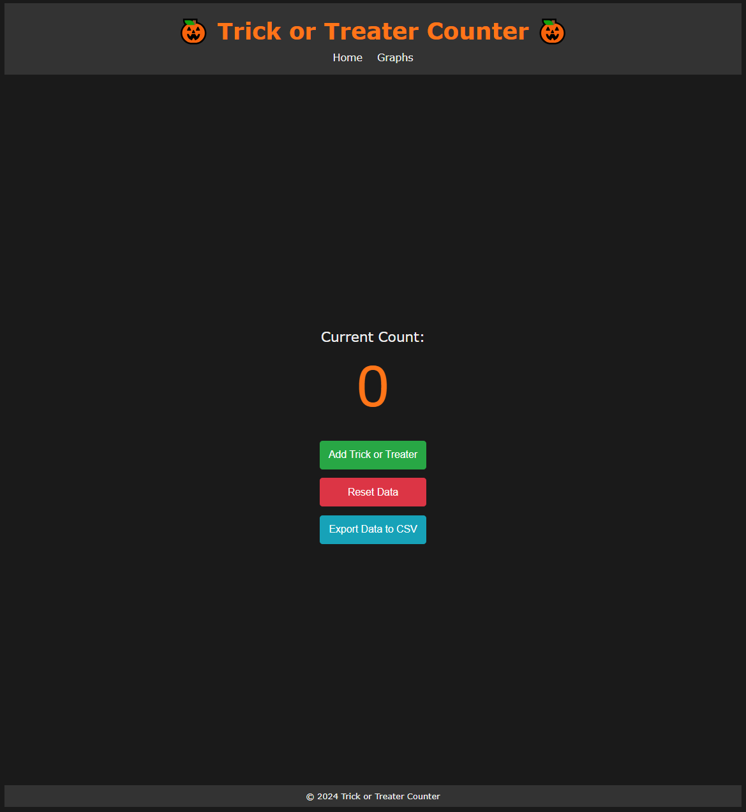

# 🎃 Trick or Treater Counter App

The **Trick or Treater Counter** is a web application built using Flask that allows you to track the number of trick-or-treaters visiting your home on Halloween. With this app, you can:
- Add trick-or-treaters as they arrive
- View cumulative and interval-based trick-or-treater counts through easy-to-read charts
- Reset the count
- Export data to a CSV file for tracking over multiple years!



## Features

- **Add Trick-or-Treaters**: Increment your count as trick-or-treaters arrive.
- **View Charts**: Visualize total trick-or-treaters and 15-minute interval counts with responsive graphs.
- **Reset Count**: Reset the count and start fresh with a single click.
- **Export to CSV**: Save your data to a CSV file for later analysis.

## Prerequisites

Ensure the following are installed:
- **Python 3.6** or higher
- **Flask** (Python web framework)
- **Chart.js** (JavaScript library for graphs, included in `static/`)

## Getting Started

### 1. Clone the Repository

```bash
git clone https://github.com/bawrr/trick-or-treater-counter.git
cd trick-or-treater-counter
```

### 2. Create a Virtual Environment (Optional but Recommended)

To isolate the app’s dependencies, create a virtual environment:

```bash
python -m venv venv
```

Activate the virtual environment:

- On macOS/Linux:
  ```bash
  source venv/bin/activate
  ```
- On Windows:
  ```bash
  venv\Scripts\activate
  ```

### 3. Install Dependencies

Install the necessary Python packages:

```bash
pip install -r requirements.txt
```

### 4. Run the App

To start the Flask app, use:

```bash
python app.py
```

The app will be accessible at **http://127.0.0.1:5000** on your local machine.

If you’d like to access the app on your phone (within the same Wi-Fi network), use:
```python
app.run(host='0.0.0.0')
```

Then, access it on your phone by replacing `127.0.0.1` with your computer’s local IP address, such as `http://192.168.x.x:5000`.

---

## Usage

1. **Add Trick-or-Treaters**: Click the **Add Trick or Treater** button each time a new trick-or-treater arrives. The app records the current timestamp automatically.
  
2. **View Charts**:
   - Visit the **Graphs** tab to see cumulative and interval-based trick-or-treater counts.
   - The **Cumulative** graph shows a continuous count of visitors.
   - The **Interval** graph (15-minute intervals) helps you understand peak times.

3. **Reset Count**:
   - Click the **Reset Data** button to start fresh for a new day or event.
   - A confirmation prompt will appear to ensure data is not reset accidentally.

4. **Export to CSV**:
   - Click **Export Data to CSV** to save your data as `trick_or_treaters.csv`.
   - This file can be used to compare trends across Halloween seasons.

## File Structure

```
trick-or-treater-counter/
├── app.py                  # Main Flask app
├── requirements.txt        # Required Python packages
├── templates/
│   ├── index.html          # Main page template
│   └── graphs.html         # Graphs page template
├── static/
│   ├── styles.css          # Styling for the app
│   ├── graphs.js           # Graphing script for Chart.js
│   └── chart.min.js        # Chart.js library (download separately or use CDN)
└── README.md               # Project documentation
```

## Buy Me a Coffee

If you find this project helpful and want to support future development, please consider [**buying me a coffee**](https://buymeacoffee.com/benralph) ☕! Your support is greatly appreciated.

## License

This project is licensed under the MIT License. See the [LICENSE](LICENSE) file for details.
